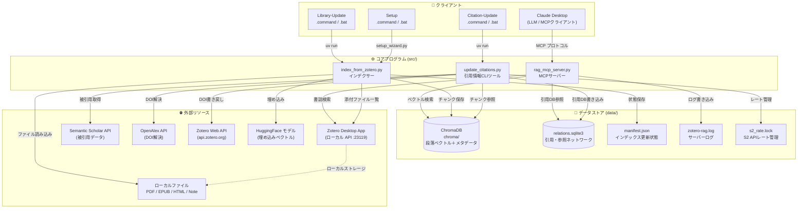
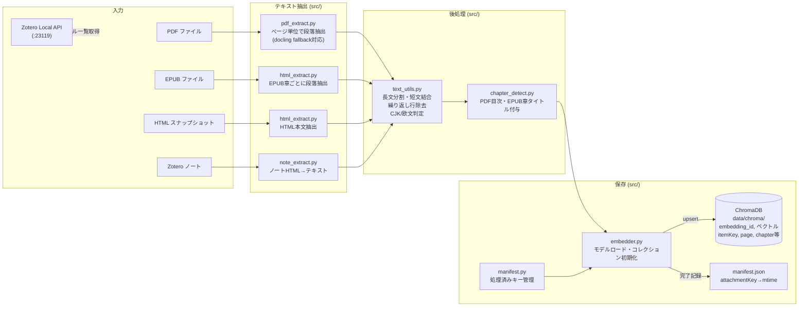
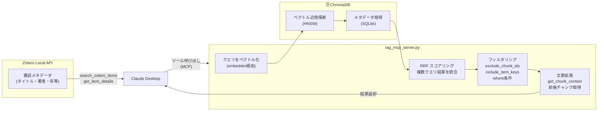
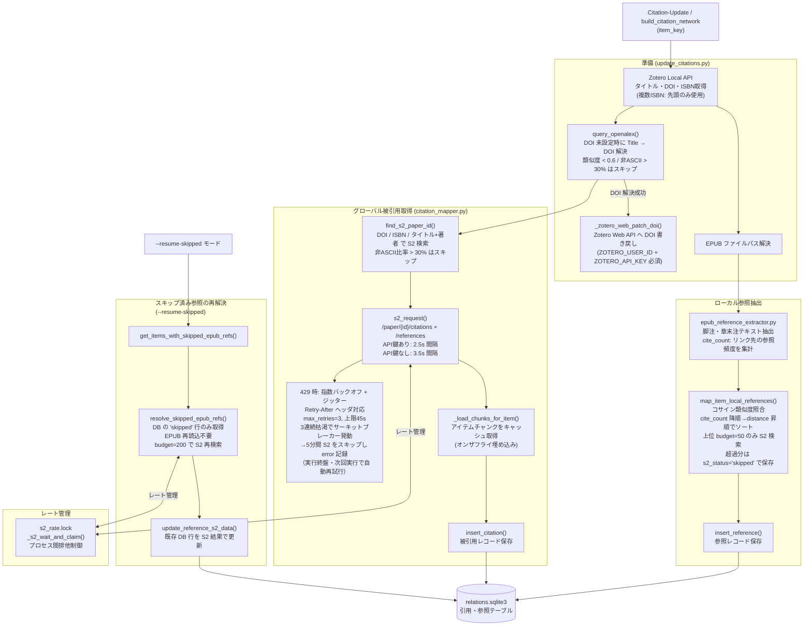

# Zotero Local RAG — アーキテクチャ図

---

## 1. システム全体図

---

## 2. インデックス構築パイプライン

`Library-Update.command` → `src/index_from_zotero.py` の処理フロー。

### 主要な chunk ID 命名規則

| ソースタイプ | chunk_id の例 |
|---|---|
| PDF | `ABCDEFGH:p12:para3:part0` (p=ページ番号) |
| EPUB | `ABCDEFGH:c5:para2:part0` (c=章インデックス) |
| HTML | `ABCDEFGH:h0:para7:part0` |
| Note | `ABCDEFGH:n0:para1:part0` |

---

## 3. RAG クエリフロー（実行時）

Claude が `rag_search` / `search_items` を呼び出したときの処理。

---

## 4. 引用ネットワーク構築フロー

`build_citation_network` ツール（または `Citation-Update.command`）の処理フロー。`--resume-skipped` モードでスキップ済み EPUB 参照を後から再解決できます。

---

## 5. ソースモジュール一覧

| ファイル | 役割 | 主な関数・クラス |
|---|---|---|
| `rag_mcp_server.py` | MCPサーバー本体。ツール定義・クエリ処理・Chroma接続管理 | 全 MCP ツール関数、`_col()`, `_z_api()` |
| `index_from_zotero.py` | インデックス構築 CLI。Zotero 添付ファイルを全件処理 | `main_async()`, `_upsert_in_subbatches()` |
| `update_citations.py` | 引用ネットワーク更新 CLI（Citation-Update 用）。`--resume-skipped` / `--epub-budget` フラグ対応。OpenAlex による DOI 解決・Zotero Web API 書き戻し | `main()`, `process_item()`, `query_openalex()`, `_zotero_web_patch_doi()`, `get_all_items()` |
| `citation_mapper.py` | S2 API 連携・引用チャンク照合・レート管理。EPUB 参照バジェット管理・スキップ済み再解決 | `find_s2_paper_id()`, `map_item_global_citations()`, `map_item_local_references()`, `resolve_skipped_epub_refs()`, `s2_request()`, `_s2_wait_and_claim()`, `_load_chunks_for_item()` |
| `db_relations.py` | relations.sqlite3 の CRUD 操作。削除済みアイテムの purge・スキップ済み参照の再解決サポート | `insert_citation()`, `insert_reference()`, `get_citations_for_chunk()`, `get_references_for_item()`, `purge_removed_items()`, `get_skipped_epub_refs()`, `get_items_with_skipped_epub_refs()`, `update_reference_s2_data()` |
| `embedder.py` | 埋め込みモデルのロード・ChromaDB コレクション初期化 | `get_collection()`, `_resolve_embedder_settings()` |
| `zotero_source_localapi.py` | Zotero ローカル HTTP API (:23119) クライアント | `ZoteroLocalAPI`, `get_item()`, `get_attachments()` |
| `pdf_extract.py` | PDF ページからの段落抽出（pdfminer ベース） | `extract_chunks_from_pdf()`, `extract_paragraphs_from_pdf_page()` |
| `html_extract.py` | HTML/EPUB スナップショットからの段落抽出 | `extract_chunks_from_html_snapshot()`, `extract_chunks_from_epub_snapshot()` |
| `note_extract.py` | Zotero ノート（HTML）のテキスト抽出 | `index_notes()` |
| `docling_extract.py` | Docling ライブラリを使った PDF 抽出（fallback） | `extract_chunks_from_pdf_with_docling()` |
| `epub_reference_extractor.py` | EPUB の脚注・章末注から参照文献テキスト抽出。リンク先の参照頻度（`cite_count`）を集計し重要度ソートに使用 | `extract_epub_references()` |
| `text_utils.py` | テキスト分割・正規化・品質判定ユーティリティ | `split_long_paragraph()`, `merge_short_chunk_records()`, `looks_like_gibberish()`, `joiner_for_text()` |
| `chapter_detect.py` | PDF 目次・EPUB 章タイトルの取得 | `get_pdf_toc()`, `get_epub_chapter_index_to_title()`, `build_pdf_page_chapter_lookup()` |
| `manifest.py` | インデックス処理済み状態の読み書き | `load_manifest()`, `save_manifest()` |

---

## 6. データストア一覧

| ファイル / DB | 場所 | 種別 | 内容 |
|---|---|---|---|
| `chroma/` | `data/chroma/` | ChromaDB (SQLite + HNSW) | 段落テキストの埋め込みベクトル、および `itemKey`, `attachmentKey`, `page`, `chapter`, `source_type` 等のメタデータ |
| `manifest.json` | `data/` | JSON | 処理済み添付ファイルの `attachmentKey → mtime` マップ。差分インデックス更新に使用 |
| `relations.sqlite3` | `data/` | SQLite | 引用ネットワーク。`citations` テーブル（外部論文からの被引用）と `references` テーブル（EPUB からの参照先）を格納 |
| `zotero.sqlite3` | Zotero App フォルダ | SQLite | Zotero が管理する書誌データ。本システムは直接アクセスせず、ローカル API 経由で取得 |
| `zotero-rag.log` | `data/` | テキスト | MCP サーバーのデバッグログ。`get_debug_logs` ツールで参照可能 |
| `s2_rate.lock` | `data/` | テキスト | Semantic Scholar API のレート管理用タイムスタンプ。`fcntl.flock` によるプロセス間排他制御 |
| `models/` | `data/models/` | バイナリ | HuggingFace からキャッシュされた埋め込みモデルファイル |

---

## 7. 設定ファイル一覧

| ファイル | 内容 |
|---|---|
| `.env` | 環境変数設定（`ZOTERO_LOCAL_API_BASE`, `S2_API_KEY`, `EMB_PROFILE`, `ZOTERO_USER_ID`, `ZOTERO_API_KEY` 等） |
| `pyproject.toml` | Python 依存パッケージ定義（uv 用） |
| `env.sh` | シェル環境変数のサンプル（手動設定用） |
| `.claude/settings.json` | Claude Code の権限設定（MCP サーバー停止コマンドの拒否ルール等） |
