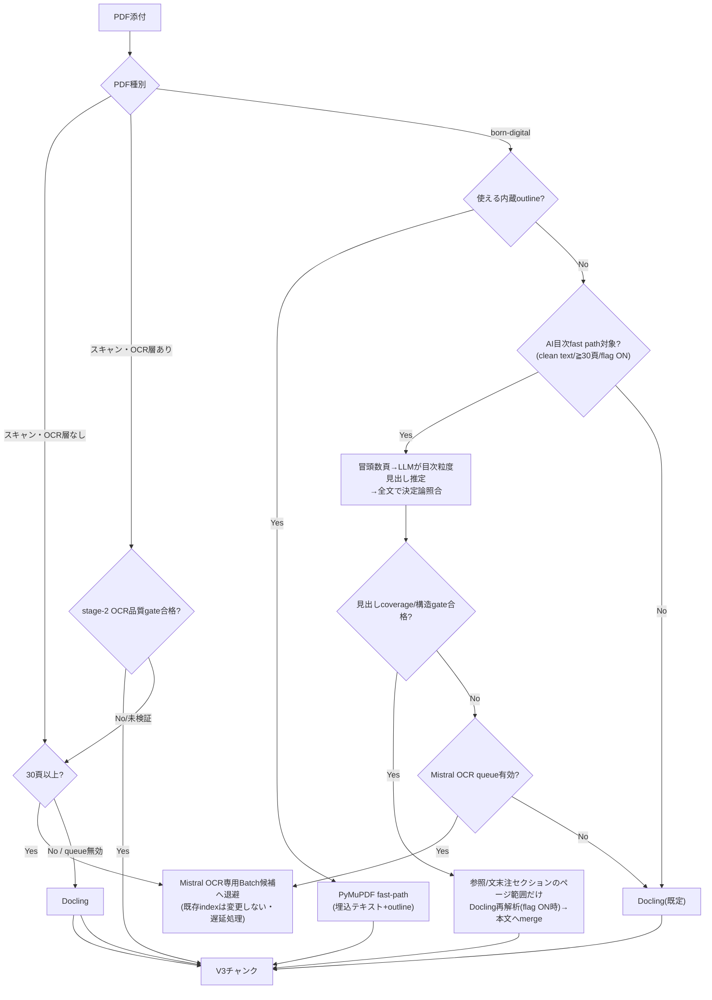
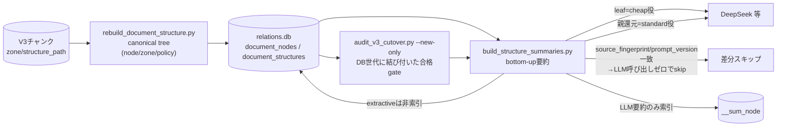
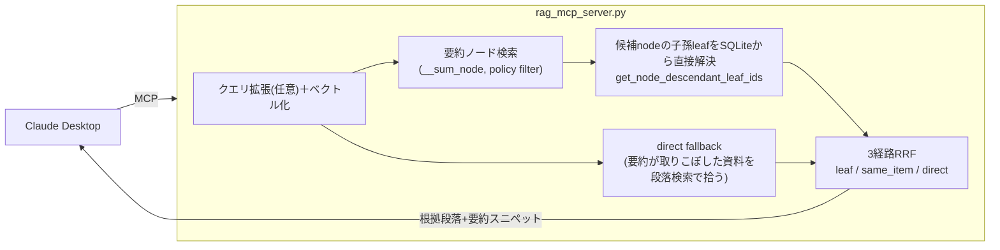

# Zotero Local RAG — アーキテクチャ図

> 現行の実装契約は [SPEC.md](../SPEC.md)、移行・品質gateの記録は
> [TASKS.md](../TASKS.md) と `evaluations/` 配下の追跡済み監査結果を参照してください。
> 本文はV3（構造化取り込み）を前提に記述しています。

---

## 0. V3データプレーン（現行本番）

2026-07-23に、検索・取り込みの本番データプレーンをV3へ切り替えました（`.env`で有効化）。

| 対象 | 現行の値 |
|---|---|
| Chroma collection | `zotero_paragraphs_v3` |
| manifest | `data/manifest_v3.json` |
| FTS（語彙索引） | `data/lexical_v3.sqlite3` |
| 構造化取り込み | `INGEST_STRUCTURED_V3_ENABLE=1` |
| 階層検索 | `HIERARCHICAL_SEARCH_V2_ENABLE=1` |

旧（legacy）collection・manifest・FTSはrollback用に1世代保持しています。ロールバックは
設定のみで、上記5値を旧値へ戻してMCPサーバーを再起動すれば元に戻ります。

**要約の現況**: 文書構造からのbottom-upなAI（LLM）要約パイプラインは実装済みですが、
全件生成はpilot→ユーザー承認待ちの段階です。検索索引（`__sum_node`）に載るのはLLM要約
のみで、抽出型（extractive）要約は索引対象外です。現時点では`__sum_node`が実質空のため、
階層検索は段落への直接検索へ縮退して動作しています。

---

## 1. システム全体図

```mermaid
flowchart TB
  subgraph CLIENT["👤 クライアント"]
    CD["Claude Desktop\n(LLM / MCPクライアント)"]
    MUC["Maintenance-Widget.command\n日常更新の統合ランチャー"]
    SC["Setup.command"]
  end

  subgraph CORE["⚙️ コアプログラム (src/)"]
    MCP["rag_mcp_server.py\nMCPサーバー"]
    IDX["index_from_zotero.py\n構造化インデクサー(V3)"]
    STR["rebuild_document_structure.py\n文書構造ツリー構築"]
    SUM["build_structure_summaries.py\nbottom-up要約 + __sum_node索引"]
    UCT["update_citations.py\n引用情報CLIツール"]
  end

  subgraph DATA["💾 データストア (data/)"]
    CHROMA[("ChromaDB\nzotero_paragraphs_v3\n段落ベクトル＋zone/構造メタ")]
    SUMCOL[("zotero_paragraphs_v3__sum_node\nLLMノード要約の検索索引")]
    RELS[("relations.db\n著作・引用・参照・構造・要約・審査")]
    FTS[("lexical_v3.sqlite3\nFTS5語彙索引")]
    MANI["manifest_v3.json\n取り込み状態"]
    LOG["zotero-rag.log"]
  end

  subgraph EXT["🌐 外部リソース"]
    ZAPP["Zotero Desktop App\n(ローカル API :23119)"]
    S2API["Semantic Scholar API"]
    OAAPI["OpenAlex API (DOI解決)"]
    LLMAPI["DeepSeek 等 LLM API\n(要約・AI目次・クエリ拡張)"]
    GROBID["GROBID (任意・ローカル)\n英語学術論文enrichment"]
    HF["埋め込みモデル"]
    FILES["ローカルファイル\nPDF / EPUB / HTML / Note"]
  end

  CD -- "MCP" --> MCP
  MUC -- "1" --> IDX
  MUC -- "1" --> STR
  MUC -- "2" --> SUM
  MUC -- "3" --> UCT
  SC -- "setup_wizard.py" --> IDX

  MCP -- "段落ベクトル検索" --> CHROMA
  MCP -- "要約ノード検索" --> SUMCOL
  MCP -- "語彙検索(hybrid)" --> FTS
  MCP -- "引用・構造・要約参照" --> RELS
  MCP -- "書誌検索" --> ZAPP

  IDX -- "zone付きチャンク" --> CHROMA
  IDX -- "FTS同期" --> FTS
  IDX -- "状態保存" --> MANI
  IDX -- "添付一覧" --> ZAPP
  IDX -- "抽出" --> FILES
  IDX -- "AI目次推定" --> LLMAPI
  IDX -- "埋め込み" --> HF

  STR -- "構造ツリー" --> RELS
  SUM -- "要約保存" --> RELS
  SUM -- "LLM要約生成" --> LLMAPI
  SUM -- "__sum_node upsert" --> SUMCOL

  UCT -- "引用・参照保存" --> RELS
  UCT -- "被引用取得" --> S2API
  UCT -- "DOI解決" --> OAAPI
  UCT -- "参照抽出(chunk)" --> CHROMA
  UCT -. "英語学術論文" .-> GROBID
```



---

## 2. インデックス構築パイプライン（V3）

`Maintenance-Widget.command` のライブラリ更新 → `src/index_from_zotero.py` の処理フロー。
抽出はソース種別ごとにルーティングされ、参照・注は取り込み時に1エントリ=1チャンクへ
境界保持されます。

```mermaid
flowchart LR
  subgraph INPUT["入力"]
    ZA["Zotero Local API (:23119)"]
    PF["PDF"]
    EF["EPUB"]
    HF2["HTMLスナップショット"]
    NF["Zoteroノート"]
  end

  subgraph EXTRACT["抽出ルーティング (src/)"]
    PDFR["PDFルーティング\n(§3)"]
    EE["html_extract.py\nDOM構造化抽出\nzone付与・注境界保持"]
    NE["note_extract.py"]
  end

  subgraph PROC["後処理 (src/)"]
    TU["text_utils.py\n長文分割・短文結合\n参照は\"\\n\\n\"境界で復元可能"]
    DS["document_structure.py\ncanonical treeメタ付与"]
  end

  subgraph STORE["保存 (src/)"]
    EMB["embedder.py\n埋め込み"]
    CHROMA2[("zotero_paragraphs_v3\nzone / structure_path / node_id\nciting_chunk_id / policy 等")]
    LEX["lexical_index.py\nFTS5同期"]
    MAN["manifest_v3.json"]
  end

  ZA --> INPUT
  PF --> PDFR
  EF --> EE
  HF2 --> EE
  NF --> NE

  PDFR --> TU
  EE --> TU
  NE --> TU
  TU --> DS
  DS --> EMB
  EMB -- "upsert" --> CHROMA2
  EMB --> LEX
  EMB --> MAN
```

### 抽出コード変更後の再取り込み

`pipeline_fingerprint` は埋め込み互換性のみを表し、抽出コードは含みません。したがって
抽出ロジックを変更しても既存itemは自動再取り込みされません。明示的にやり直すには
scopeを指定して `--force-reparse` を使います（無指定の全件再取り込みは禁止）。

```bash
uv run src/index_from_zotero.py --force-reparse --item ABCDEFGH
uv run src/index_from_zotero.py --force-reparse --source-type epub --limit 20
```

### 主要な chunk ID 命名規則

| ソースタイプ | chunk_id の例 |
|---|---|
| PDF | `ABCDEFGH:p12:para3:part0`（p=ページ番号） |
| PDF参照節(Docling再解析) | `ABCDEFGH:docref:...` |
| EPUB | `ABCDEFGH:epub:block72:part0`（block=文書内ブロック連番） |
| HTML | `ABCDEFGH:html:block7:part0` |
| Note | `ABCDEFGH:note:para1:part0` |

V3ではチャンクに加えて `zone`（body/bibliography/footnote/endnote/toc/index/colophon/
back_matter 等）、`structure_path`、`node_id`、`policy`、注は `citing_chunk_id` の
メタデータが付与されます。

---

## 3. 抽出ルーティング

### PDF（`src/index_from_zotero.py` / `pdf_toc_recovery.py` / `docling_extract.py`）



- **AI目次fast path**（`PDF_AI_TOC_FAST_PATH_ENABLE=1` / `PDF_AI_TOC_MIN_PAGES=30`）は
  冒頭テキストをLLMへ送ります（`PDF_AI_TOC_FAST_PATH_ENABLE`が唯一のゲート。
  資料単位の除外タグは2026-07-27に撤去）。AIの印刷ページ番号は採用せず、
  全文で再発見した見出しとreading orderだけを構造境界に使います。
- **参照/文末注セクションのDocling再解析**（`PDF_AI_TOC_DOCLING_REFERENCES_ENABLE=1`・
  既定off・fail-closed）は、AI目次が特定したページ範囲だけをDoclingで再解析し、
  1エントリ=1チャンクの参照構造を本文へmergeします。ページ下部に散在する脚注は
  レイアウト解析が必要なため本手法の対象外です。
- **スキャンPDFのOCR route**: OCR層なし、またはstage-2品質gateが`acceptable`以外の
  スキャンPDFは、30頁未満ならDocling、30頁以上ならMistral OCR専用queueへ
  退避します（`PDF_MISTRAL_TOC_QUEUE_ENABLE`が無効なら常にDocling）。RapidOCR/NDLOCR
  は通常PDF経路に入れず、固定レイアウトEPUBと明示re-OCRだけに残します。
- **Mistral OCR専用queue**（`PDF_MISTRAL_TOC_QUEUE_ENABLE=1`）は、上記の長いスキャンと
  AI目次gate不合格のPDFを、既存indexを変更せず候補状態へ退避し、公式Mistral
  Batch APIへ後からまとめて送ります。品質gate合格分だけを非正本の採用queueへ出し、
  `--reocr-candidates`経路でV3正本へ書きます。通常PDFの自動経路では同期Mistral送信を
  行いません。
- **WidgetでのBatch運用**: `Maintenance-Widget.command` の第5項目は明示許可制です。
  初回は送信だけを行い、完了後の次回起動で状態確認→回収→品質gate→V3採用→文書構造更新を
  実行します。採用済みBatchは状態ファイルで記録し、二重採用しません。

### EPUB / HTML（`src/html_extract.py`）

- DOM構造化抽出で各ブロックにzoneを付与します（body/bibliography/footnote/endnote/
  toc/index/colophon/back_matter 等）。
- 参照・注zoneでは「1エントリ=1原子単位」を保持します。`<li>`/`<dd>`/複数`<p>`/`<br/>`を
  境界としてエントリ分割し、インライン要素（`<em>`/`<a>`）では分割しません。本文zoneは
  従来どおり段落結合します。
- 本文ブロックの `noteref`（`a[epub:type~=noteref]` 等）を検出し、`(章index, note_id)` を
  キーに脚注・章末注チャンクへ `citing_chunk_id` を決定論的に付与します（同一spine内の
  注のみ。別ファイル文末注は誤リンク回避のため未リンク）。類似検索は使いません。
- 固定レイアウトの画像EPUBは、OPF spine順の画像をローカルOCRへ回し、OCR後に元の
  `epub:spineN` locatorへ決定的に戻します。

---

## 4. 文書構造V3と要約



- 文書構造は `document_structure.py` がchunkのzone/structure_pathから
  canonical tree（node/zone/policy）を構築し、`validate_structure` で親子順序・
  coverage・境界跨ぎ0を検証します。
- 要約はbottom-upで、leafは`cheap`役、親ノード（章・item root）の還元は仕様通り
  `standard`役（DeepSeek）です。`source_fingerprint`/`prompt_version`が現行構造と
  一致すればLLMを呼ばずにskipします（`--force`で再生成）。
- 検索索引 `__sum_node` にはLLM要約のみ格納し、extractive要約は索引しません。
  全件LLM backfillはDB完全監査後に別フェーズで実行します。監査後にmanifest、
  Chroma/FTSのchunk ID、または文書構造が変化するとgate fingerprintが一致せず、
  要約開始前にfail-closedで停止します。

---

## 5. 階層検索フロー（実行時）

`hierarchical_search`（`HIERARCHICAL_SEARCH_V2_ENABLE=1`）の処理。



- leaf限定・policy filter・3経路RRF（leaf / same_item / direct）・direct fallbackで
  構成します。候補nodeの子孫leaf解決はChroma往復ではなくSQLiteから直接引きます。
- `__sum_node` が空の間はsummary routing経路が縮退し、direct fallback（段落直接検索）
  のみが実質的に動作します。
- `rag_search` はベクトル検索とローカルFTS5語彙検索をRRFで統合（`hybrid=true`既定）します。
  `search_mode="case"` は仮想事例文（HyDE）と抽象度展開を併用し、テーマ外の
  民族誌的事例を段落レベルで直接探します（構造化事例DBは廃止済みで、これは索引を介さない
  段落検索です）。

---

## 6. 引用ネットワーク構築フロー

`build_citation_network` / `Maintenance-Widget.command` のCitation Network更新の処理。

```mermaid
flowchart TD
  START["Citation Network更新\n(item_key)"] --> ZITEM

  subgraph PREP["準備 (update_citations.py)"]
    ZITEM["Zotero Local API\nタイトル・DOI・ISBN取得"]
    DOIS["query_openalex()\nDOI未設定時にTitle→DOI解決"]
    WEBPATCH["Zotero Web APIへDOI書き戻し(任意)"]
  end

  subgraph LOCAL["ローカル参照抽出 (R6採用後)"]
    CHUNKREF["chunk_reference_extractor\nextract_references_from_chunks(item_key)\nV3のbibliography/endnote/footnote zoneから\n参照候補を復元(二重パース廃止)"]
    CMATCH["map_item_local_references()\ncite_count降順→上位budgetのみS2解決\n超過分はs2_status='skipped'で保存"]
  end

  subgraph GROBIDE["英語学術論文enrichment (任意)"]
    GB["run_grobid_enrichment.py\nGROBID TEI→参考文献/本文中引用を\nreference_review_queueへreview-onlyでstage\n(works graphへ直接書かない)"]
  end

  subgraph GLOBAL["被引用取得 (citation_mapper.py)"]
    FIND["find_s2_paper_id()\nDOI/ISBN/タイトル+著者でS2検索"]
    S2REQ["s2_request()\n/citations + /references\nレート管理・指数バックオフ"]
    CINSERT["insert_citation()\n被引用レコード保存"]
  end

  ZITEM --> DOIS --> WEBPATCH
  ZITEM --> CHUNKREF --> CMATCH --> RELS2
  DOIS --> FIND --> S2REQ --> CINSERT --> RELS2
  GB -. "独立実行(埋め込みと分離)" .-> RELS2
  RELS2[("relations.db\n引用・参照・審査キュー")]
```



- **ローカル参照抽出（R6, 2026-07-24採用）**: 従来のEPUB二次パースを廃止し、
  取り込み時に境界保持されたV3チャンク（bibliography/endnote/footnote zone）から
  参照を復元します（`chunk_reference_extractor.extract_references_from_chunks`）。
  旧 `epub_reference_extractor.py` は非推奨バナー付きで退役し、検証ツールのみが参照します。
- **GROBID enrichment（任意）**: `itemType` が `journalArticle`/`conferencePaper`/`preprint`
  の英語PDFに限定し、本文埋め込みトランザクションと分離して実行します。結果は
  `reference_review_queue` へreview-onlyでstageし、works graphへは直接書きません。

---

## 7. ソースモジュール一覧

| ファイル | 役割 |
|---|---|
| `rag_mcp_server.py` | MCPサーバー本体。ツール定義・検索・階層検索・Chroma接続管理 |
| `index_from_zotero.py` | 構造化インデックス構築CLI（V3）。PDFルーティング・zone付与・`--force-reparse` |
| `html_extract.py` | EPUB/HTMLのDOM構造化抽出。zone付与・参照/注境界保持・`citing_chunk_id` |
| `pdf_extract.py` | PyMuPDFベースのPDF段落抽出 |
| `pdf_toc_recovery.py` | AI目次fast path（見出し推定→全文照合）・参照節Docling再解析の統合 |
| `docling_extract.py` | Doclingによる高精度PDF抽出・参照セクション再解析 |
| `mistral_ocr_extract.py` | Mistral OCR（クラウド・Batch API）アダプタ |
| `ndlocr_extract.py` | NDLOCR-Lite（日本語ローカルOCR）アダプタ |
| `note_extract.py` | Zoteroノート（HTML）のテキスト抽出 |
| `text_utils.py` | 長文分割・短文結合・繰り返し除去・CJK/欧文判定 |
| `document_structure.py` | canonical tree構築・zone正規化・構造検証 |
| `build_structure_summaries.py` | bottom-up要約生成・差分スキップ・`__sum_node`索引 |
| `summary_core.py` | 要約プロンプト・スキーマ・共通ヘルパー |
| `embedder.py` | 埋め込みモデルロード・Chromaコレクション初期化 |
| `lexical_index.py` | FTS5語彙索引（Chromaチャンクと同期） |
| `chunk_store.py` | V3チャンクの取得ユーティリティ |
| `update_citations.py` | 引用ネットワーク更新CLI。OpenAlex DOI解決・Web API書き戻し |
| `citation_mapper.py` | S2連携・引用チャンク照合・レート管理・ローカル参照(chunk)呼び出し |
| `chunk_reference_extractor.py` | V3チャンクからの参照/注抽出（bibliography/endnote/footnote zone） |
| `db_relations.py` | `relations.db` のCRUD。著作・引用・構造・要約・審査キュー・artifact状態 |
| `recommendations.py` | 関連資料（coupling/cocitation/semantic/hybrid） |
| `citation_insights.py` | 引用グラフ・階層要約ビュー用データAPI |
| `zotero_source_localapi.py` | Zoteroローカル HTTP API (:23119) クライアント |

---

## 8. データストア一覧

| ファイル / DB | 場所 | 種別 | 内容 |
|---|---|---|---|
| `zotero_paragraphs_v3` | `data/chroma/` | ChromaDB | 段落埋め込み＋zone/structure_path/node_id/policy/citing_chunk_id 等のメタデータ |
| `zotero_paragraphs_v3__sum_node` | `data/chroma/` | ChromaDB | LLMノード要約の検索索引（extractiveは非格納） |
| `lexical_v3.sqlite3` | `data/` | SQLite (FTS5) | 段落チャンクのトライグラム語彙索引。hybrid検索に使用 |
| `manifest_v3.json` | `data/` | JSON | 処理済み添付の状態マップ。差分取り込みに使用 |
| `relations.db` | `data/` | SQLite | 著作、引用・参照、文書構造(nodes/structures)、要約、審査キュー、artifact処理状態 |
| `zotero.sqlite` | Zoteroフォルダ | SQLite | Zotero管理の書誌データ。通常はローカルAPI経由 |
| `zotero-rag.log` | `data/` | テキスト | MCPサーバーのログ。`get_debug_logs` で参照可能 |
| `s2_rate.lock` | `data/` | テキスト | Semantic Scholar APIレート管理（`fcntl.flock`） |
| `models/` | `data/models/` | バイナリ | キャッシュした埋め込みモデル |

legacy stores（旧 `chroma` collection・`manifest.json`・`lexical.sqlite3`）はrollback用に
1世代保持しています。

---

## 9. 設定ファイル一覧

| ファイル | 内容 |
|---|---|
| `.env` | 環境変数設定（V3データプレーン・埋め込み・LLMロール・PDFルーティング flag 等）。詳細は [環境設定](configuration.md) |
| `.env.example` | 実在キーの正本ひな形 |
| `.env.policy` | 撤去済み（2026-07-27。内容は無効化して残置） |
| `pyproject.toml` / `requirements.txt` | Python依存定義 |
| `.claude/settings.json` | Claude Code の権限設定 |
